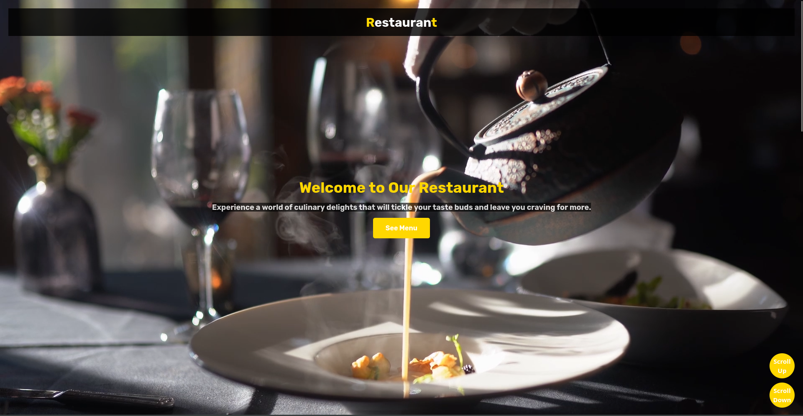
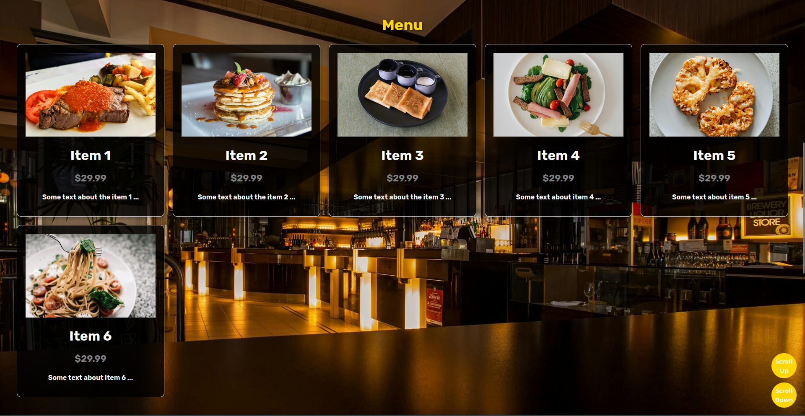
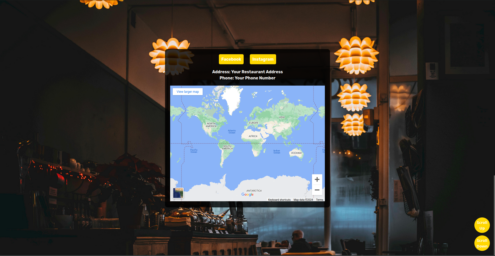

# Restaurant Website

Welcome to the Restaurant Website project! This web application showcases a modern and visually appealing design for a restaurant website. It includes multiple partitions with different content, providing an engaging experience for visitors.

## Features

- **Main Partition**: Introduction to the restaurant with a background video and an invitation to explore the menu.
- **Menu Partition**: Display of various menu items with images, prices, and descriptions in a grid layout.
- **Info Partition**: Information section with social media links, contact details, and an embedded Google Map.
## Screenshots


*Main Partition*


*Menu Partition*


*Info Partition*

## Technologies Used

- HTML
- CSS
- JavaScript

## Setup

1. Clone the repository:

```bash
git clone https://github.com/OthmaneRegragui/Restaurant_Website.git
```

2. Open the `index.html` file in your web browser.

## Customization

Feel free to customize the content, styling, and add your restaurant's information to make it your own!

## Contributing

If you'd like to contribute to this project, please follow the [contribution guidelines](CONTRIBUTING.md).

## License

This project is licensed under the [MIT License](LICENSE).

## Happy coding!

